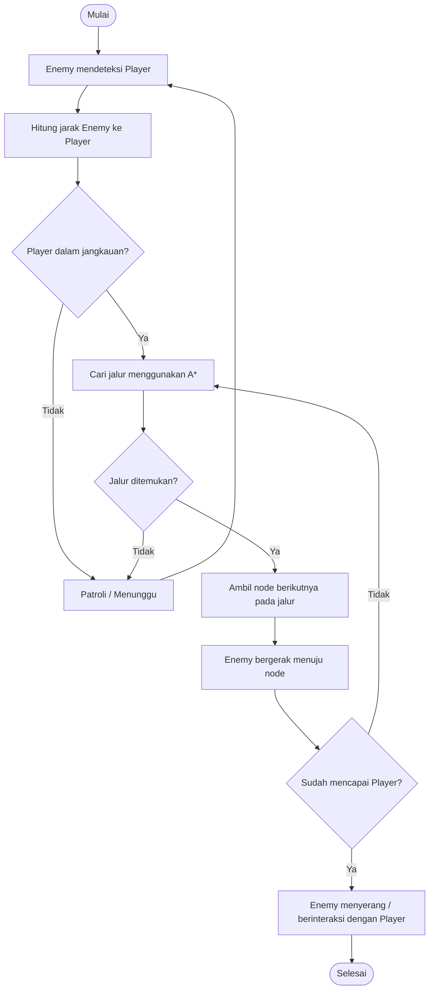

# Flowchart Algoritma Enemy

```mermaid
flowchart TD
    A([Mulai]) --> B[Enemy mendeteksi Player]
    B --> C[Hitung jarak Enemy ke Player]
    C --> D{Player dalam jangkauan?}
    D -- Tidak --> E[Patroli / Menunggu]
    E --> B
    D -- Ya --> F[Cari jalur menggunakan A*]
    F --> G{Jalur ditemukan?}
    G -- Tidak --> E
    G -- Ya --> H[Ambil node berikutnya pada jalur]
    H --> I[Enemy bergerak menuju node]
    I --> J{Sudah mencapai Player?}
    J -- Tidak --> F
    J -- Ya --> K[Enemy menyerang / berinteraksi dengan Player]
    K --> L([Selesai])
```
